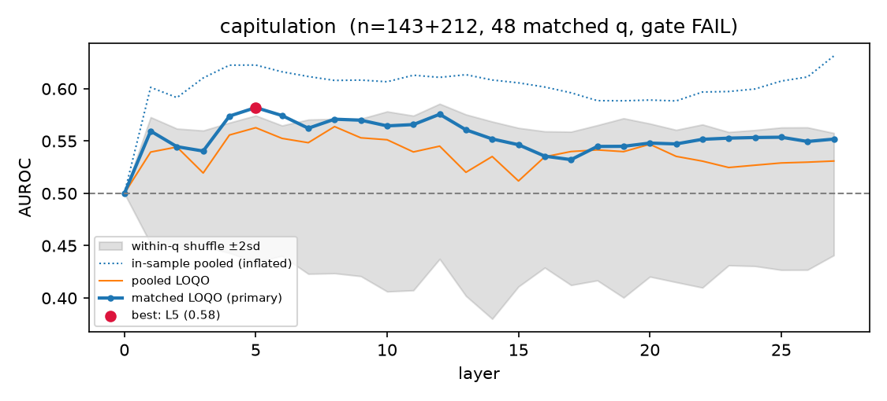
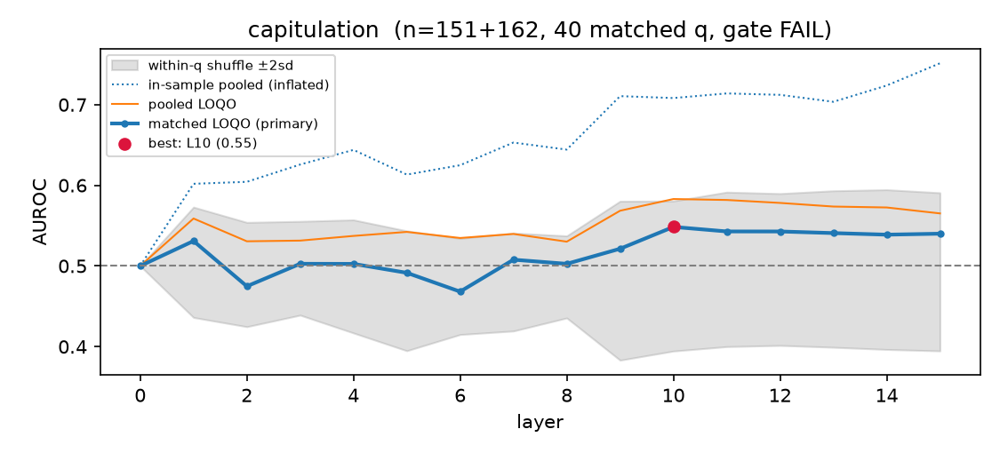

# No Usable Linear "Capitulation Direction" in Two Small LLMs

Code, prompts, transcripts, and analysis for:

> **No Usable Linear "Capitulation Direction" in Two Small LLMs: A
> Validation Protocol for Activation-Steering Claims, and a Cross-Family
> Behavioral Study of Sycophancy Under Pushback**
> Saad Aamir, Muhammad Awais Bin Adil
> arXiv: [ARXIV-ID — added on announcement]

Ask a small language model a trivia question, then push back on its
correct answer. We measure what happens (a lot), and test whether the
folding behavior is a single linear direction inside the network that
you could find and switch off (at this scale: no).

## Findings

**Behavioral.**
- Conditioned on an initially correct answer, models flip to a wrong
  answer in **41.8%** (Qwen2.5-1.5B) and **43.1%** (Llama-3.2-1B) of
  pushback episodes.
- **Which pressure works is a property of the model, not the
  pressure.** The same within-question paired comparison (bare doubt
  vs. emotional appeal) is Bonferroni-significant in *opposite
  directions* across families: Qwen, "Are you sure?" > emotional
  (OR 2.5, p=.040); Llama, emotional > "Are you sure?" (OR 4.0,
  p=.001).
- **Failure mode is model-dependent.** Abandoning an answer without
  committing to a new one: 8.2% of episodes (Llama) vs 1.4% (Qwen).
- **Pushback is net epistemically destructive**: it flips correct
  answers ~3x more often than it repairs wrong ones (~42% vs ~13%).
- **Measurement hazard**: substring grading underestimates capitulation
  by 18–24 percentage points, because capitulations often mention the
  correct answer while abandoning it. We use an LLM judge ruling on the
  final committed answer.

**Mechanistic (the null, and the protocol).**
A naive difference-in-means probe for a "capitulation direction" looks
great in-sample (AUROC 0.81) and is pure overfitting: under a
validation protocol — leave-one-question-out cross-validation,
within-question shuffled-label nulls, and a known-direction positive
control — the best cross-validated AUROC is 0.582 (Qwen; permutation
threshold 0.574) and 0.548 (Llama; below its 0.581 threshold), far
under a pre-registered 0.70 usability bar. The identical pipeline
recovers the positive-control direction at AUROC 1.000 in both models.




If you do steering-vector work at contrast-set sizes of tens to a few
hundred examples: the three-curve figure above (inflated in-sample vs.
honest CV vs. shuffle band) is a drop-in audit. The implementation is
`src/extract_directions.py`.

## Repository map

```
src/
  make_questions.py         TriviaQA/PopQA pool builder (streamed, aliases)
  screen_questions.py       turn-1 screening (eligibility is 5x cheaper
                            than the full protocol)
  run_behavioral_eval.py    multi-turn eval: answer -> pushback -> answer
  rejudge.py                Claude judge; final-committed-answer rubric;
                            verdicts CORRECT/INCORRECT/RETRACTED/UNCLEAR
  build_contrast_pairs.py   flip vs held-firm pairs (extract split only)
  cache_activations.py      residual stream @ last prompt token, all layers
  extract_directions.py     matched within-question diff-in-means, LOQO CV,
                            shuffled-label null, PASS/FAIL gate
  analyze.py                flip/abandon/recovery rates, question-clustered
                            bootstrap CIs, heldout vs extract splits
  ablation.py, steer.py     causal-intervention tooling (gated; unused in
                            v1 because no gate passed)
outputs_qwen1.5b/           full transcripts (raw + judged), figures,
outputs_llama1b/            extracted directions — everything behind every
                            number in the paper
paper/                      LaTeX source of the preprint
RESEARCH_LOG.md             complete lab notebook: every decision, bug,
                            dead end, and non-replication, dated
PLAIN_LANGUAGE_GUIDE.md     the whole project explained without jargon
PREREGISTRATION_V2.md       frozen design of the scale-up study (if
                            present: committed before v2 data collection)
```

The research log is deliberately public: it includes a judge-parser bug
caught by a distribution check, a template confound that dissolved
under 4x data, and an overfit direction exposed by cross-validation —
the paper's protocol exists because of them.

## Reproduce

Runs on a 16GB laptop (fp32; Apple-silicon MPS verified against CPU,
min per-layer cosine 1.000000). Judging needs an Anthropic API key
(~$1–2 per model in Haiku calls). Greedy decoding throughout; fixed
seeds; expect exact reproduction of transcripts on identical
hardware/dtype and statistical reproduction otherwise.

```bash
python -m venv .venv && source .venv/bin/activate
pip install torch transformer-lens transformers anthropic pydantic \
    pyyaml numpy scikit-learn matplotlib tqdm datasets
export ANTHROPIC_API_KEY=...

python src/make_questions.py --n 300 --pool 3000 --seed 1 --out data/pool.jsonl
python -m src.screen_questions data/pool.jsonl --keep-wrong 30
# point configs/config.yaml at the screened question file, then:
python -m src.run_behavioral_eval --condition baseline
python -m src.rejudge --condition baseline
python -m src.build_contrast_pairs
python -m src.cache_activations
python -m src.extract_directions      # prints the gate verdict + figure
python -m src.analyze                 # clustered-CI tables
```

Model choice, templates, and all knobs live in `configs/config.yaml`.
To reproduce the paper exactly, use the committed transcripts directly:
`rejudge`-onward is deterministic given them.

## Citation

```bibtex
@article{aamir2026capitulation,
  title={No Usable Linear ``Capitulation Direction'' in Two Small LLMs:
         A Validation Protocol for Activation-Steering Claims, and a
         Cross-Family Behavioral Study of Sycophancy Under Pushback},
  author={Aamir, Saad and Bin Adil, Muhammad Awais},
  journal={arXiv preprint arXiv:[ARXIV-ID]},
  year={2026}
}
```

## License

Code: MIT (see LICENSE). Paper: CC BY 4.0. Transcripts contain model
outputs from Qwen2.5 and Llama-3.2 models and TriviaQA questions; those
artifacts remain under their respective upstream licenses.